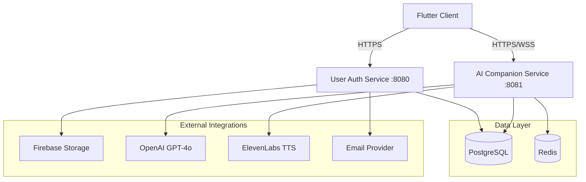

# Vixie AI Backend

The Vixie AI backend is a microservices-based system built with **Java 21** and **Spring Boot 4.0.1**. It powers the companion AI application by handling user authentication, character management, and real-time AI interactions.

## 🏗️ Architecture Overview

The system consists of two primary services that communicate over a shared database layer and follow a unified security model.



### 1. User Authentication Service (`user-auth`)
*   **Purpose**: Centralized identity provider and user data management.
*   **Port**: `8080`
*   **Core Responsibilities**:
    *   JWT Token Issuance (HS256).
    *   Social Login (Google & Facebook OAuth2).
    *   OTP-based Email Verification & Password Reset.
    *   Profile Management (Avatar uploads via Firebase).
    *   User Preferences persistence.

### 2. AI Companion Service (`ai-companion`)
*   **Purpose**: Real-time interaction engine for AI companions.
*   **Port**: `8081`
*   **Core Responsibilities**:
    *   **STOMP over WebSocket**: Streaming AI chat responses.
    *   **LLM Integration**: Orchestrating OpenAI GPT-4o completions.
    *   **Voice System**: ElevenLabs TTS integration with phoneme timestamping for lip-sync.
    *   **State Management**: Caching conversation context in Redis for low-latency responses.

---

## 🛠️ Technology Stack

| Category | Technology |
|---|---|
| **Language** | Java 21 |
| **Framework** | Spring Boot 4.0.1 |
| **Security** | Spring Security + JJWT |
| **Database** | PostgreSQL 15 |
| **Caching** | Redis 7 |
| **API Docs** | SpringDoc OpenAPI (Swagger UI) |
| **Messaging** | STOMP (WebSocket) |
| **Cloud** | Firebase Admin SDK (Storage) |

---

## 📂 Project Structure

Both services follow a clean, layered architecture:

```text
vixie-backend/
├── user-auth/
│   ├── src/main/java/com/neong/vixie/
│   │   ├── config/             # Security, JWT, OAuth2 config
│   │   ├── controllers/        # REST API Endpoints
│   │   ├── services/           # Business logic & Interfaces
│   │   ├── repository/         # JPA Repositories
│   │   ├── entity/             # Database Models (JPA)
│   │   └── dto/                # Data Transfer Objects (Records)
│   └── docker-compose.yml      # PostgreSQL container
├── ai-companion/
│   ├── src/main/java/com/neong/vixie/
│   │   ├── config/             # WebSocket, Redis, AI config
│   │   ├── controllers/        # REST & WebSocket Handlers
│   │   ├── helpers/            # API response wrappers & exceptions
│   │   └── security/           # Shared JWT validation logic
│   └── docker-compose.yml      # Redis container
└── SETUP.md                    # Detailed environment setup guide
```

---

## 🔑 Shared Conventions

### 1. Unified Security Model
Both services use a **Shared JWT Secret**. `user-auth` issues the tokens, and `ai-companion` validates them using the same signing key. This allows for stateless authentication across the microservices.

### 2. Custom ID Generation
The system uses a human-readable, collision-resistant ID format:
`<table>_id_<6digits>_<yyyy-mm-dd>` 
*(e.g., `user_id_123456_2026-05-11`)*

### 3. Auditing
All database entities extend `AuditableEntity`, providing automatic tracking of:
*   `createdAt` / `updatedAt`
*   `createdBy` / `updatedBy`

### 4. API Design
*   **Naming**: `SNAKE_CASE` for JSON properties.
*   **Error Handling**: Global `@RestControllerAdvice` providing structured `ErrorResponse` objects with specific application error codes.

---

## 🚀 Getting Started

1.  **Infrastructure**: Start PostgreSQL and Redis using the provided `docker-compose.yml` files in each service directory.
2.  **Environment**: Copy `.env.example` to `.env` in both directories and fill in the required keys (OpenAI, ElevenLabs, Google OAuth, etc.).
3.  **Run**: Use `./mvnw spring-boot:run` to start the services.

For detailed installation steps, please refer to [**SETUP.md**](./SETUP.md).
